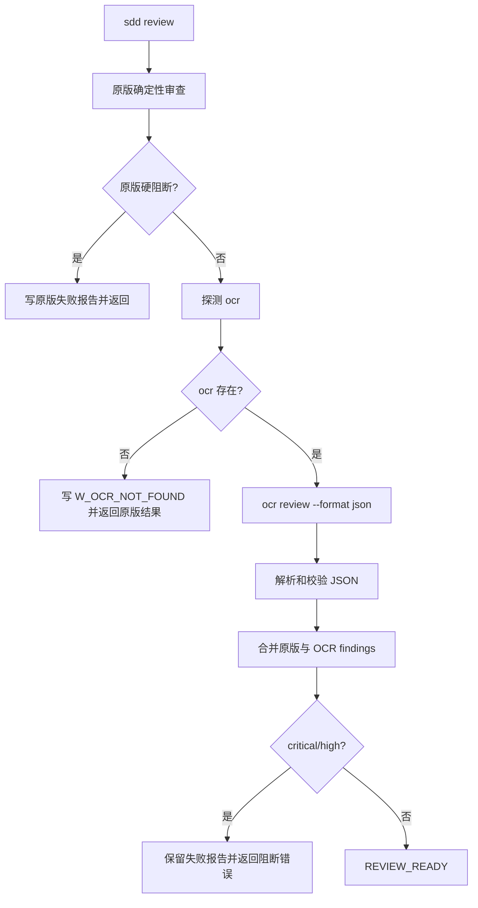

# `sdd review` 串行 OCR 审查设计

## 目标

在不改变现有确定性审查门禁的前提下，让 `sdd review` 先执行原版确定性审查，再在系统存在 `ocr` 可执行文件时调用 Alibaba Open Code Review 进行补充审查；未安装 `ocr` 时给出明确警告并仅使用原版结果。

## 已确认的行为

1. 原版确定性审查是必经阶段，负责验证报告、Git 漂移、文件范围、依赖声明、敏感信息和变更规模。
2. 原版发现安全、范围或其他 `critical/high` 阻断时，保留原版失败报告，不启动 OCR。
3. 原版通过后自动按配置探测 `ocr`，默认命令名为 `ocr`，不通过 shell 执行。
4. 找不到 `ocr` 时返回原版结果，同时输出 `W_OCR_NOT_FOUND` 警告：`未找到 ocr，已跳过 OCR，仅执行原版 review`。
5. OCR 已找到但进程启动失败、超时、非零退出或输出非法时硬失败，不降级为“原版加 OCR 已完成”。
6. OCR 成功后，其 finding 与原版 finding 合并；最终 `critical/high` 阻断，`medium/low` 仅记录。
7. 敏感信息扫描在任何外部进程启动前完成；禁止把 API key、prompt、思维链、完整 stderr 写入报告或日志。
8. OCR 的 `thinking` 字段不持久化；仅保留可展示和可定位的评论字段。

## 架构



`commands/review.rs` 只负责阶段编排和报告落盘；OCR 进程管理、JSON 模型和 finding 校验放在独立的 `quality/ocr.rs`，避免把外部协议细节继续堆入命令函数。

## 配置和 CLI

默认 `sdd review` 自动执行确定性审查并探测 OCR。配置增加：

```json
{
  "quality": {
    "ocr": {
      "mode": "auto",
      "command": "ocr"
    }
  }
}
```

- `auto`：原版通过后探测并调用 OCR；找不到时警告并回退原版。
- `off`：只执行原版确定性审查。
- `required`：原版通过后找不到 OCR 也返回 `E_REVIEW_BACKEND_UNAVAILABLE`。
- `command`：OCR 可执行文件名或路径；使用 `Command::new`，不拼接 shell 字符串。

不增加 `--backend ocr` 作为必需参数；命令默认行为直接符合“原版后 OCR”的流程。后续如确有一次性覆盖配置的需求，再增加与配置同名的显式 CLI 参数。

## OCR 进程协议

适配器运行：

```text
<command> review --format json
```

工作目录是业务 worktree。stdout 必须是单个 JSON 文档；stderr 只用于诊断，错误消息必须截断并脱敏。进程需要继承现有 review timeout，并在超时后终止子进程。

OCR 输出按官方 `LlmComment` 模型读取：

- `path`
- `content`
- `existing_code`
- `suggestion_code`
- `start_line`
- `end_line`
- `category`
- `severity`

`status` 为成功或无评论时才算 OCR 成功；`partial`、`failed`、非零退出、超时和无法解析的 JSON 都转换为稳定 SDD 错误。

## Finding 校验和映射

每条 OCR finding 必须满足：

- 路径是相对路径，不含 `..`，且属于本次变更文件；
- 行号从 1 开始，`start_line <= end_line`，并且不超过当前文件行数；
- `severity` 属于 `critical`、`high`、`medium`、`low`；
- `category` 属于 `bug`、`security`、`performance`、`maintainability`、`test`、`style`、`documentation`、`other`；
- 有建议代码时保留原始代码和建议代码，便于人工审查；
- 超出变更 hunk 的合法行级评论可以展示，但不得单独提升为阻断；
- 非法 finding 使整个 OCR 结果失败，避免静默丢失定位错误。

`quality::report::Issue` 增加可选的 `category`、`startLine`、`endLine`、`existingCode`、`suggestionCode` 和 `origin` 字段。原版 finding 的既有 JSON 形状保持兼容，OCR finding 使用 `origin: "ocr"` 和 `code: "OCR_FINDING"`。

报告的 `minimality` 或扩展元数据记录 `backend`、OCR session ID、审查文件数和评论数，不记录 prompt、思维链和凭据。

## 错误和状态

| 场景 | 行为 |
| --- | --- |
| 找不到 OCR，`mode=auto` | `W_OCR_NOT_FOUND`，返回原版结果 |
| 找不到 OCR，`mode=required` | `E_REVIEW_BACKEND_UNAVAILABLE` |
| OCR 进程超时 | `E_REVIEW_BACKEND_TIMEOUT` |
| OCR 非零退出或失败状态 | `E_REVIEW_BACKEND_FAILED` |
| OCR JSON/finding 非法 | `E_REVIEW_BACKEND_INVALID_OUTPUT` |
| 原版敏感信息阻断 | `E_SECURITY_BLOCKED`，不启动 OCR |
| 合并结果含 `critical/high` | 按现有 review 失败状态和错误优先级返回 |

OCR 失败时报告仍然保留在 runtime，状态回到 `VERIFY_READY`，下一步为 `sdd review`。缺少可选 OCR 时，状态、退出码和 `passed` 完全由原版结果决定。

## 安全约束

- 不通过 shell 执行外部命令；参数使用固定 argv；
- 工作目录必须是已验证的业务 worktree；
- 只读取 OCR 的 stdout JSON；限制 stdout/stderr 大小；
- 错误日志中不得出现凭据、prompt、源代码全文或思维链；
- 敏感信息扫描必须在进程启动前完成；
- 外部返回的路径和行号必须经过仓库边界和文件内容校验。

## 测试策略

新增和修改测试覆盖：

1. 默认 `auto` 在原版通过后调用 OCR；`off` 不调用 OCR。
2. 原版硬阻断时 OCR 不启动。
3. OCR 命令不存在时返回原版结果并携带 `W_OCR_NOT_FOUND`。
4. OCR 成功 JSON 的 finding 映射、行号、分类、严重级别和建议代码保留。
5. OCR 空评论成功；OCR `critical/high` 阻断；`medium/low` 不阻断。
6. OCR 超时、非零退出、失败状态、非法 JSON、非法路径和非法行号均硬失败并保留报告。
7. secrets scanner 在外部进程启动前阻断。
8. CLI、report schema、runtime 报告和 Markdown 渲染保持 camelCase 与现有契约。
9. 现有确定性 review、quality chain 和 workspace 全量测试不回归。

## 范围外

- 不移植 OCR 的 Go Agent、规则引擎、工具链或 LLM provider；
- 不复刻 OCR 的 session viewer、遥测和交互式配置；
- 不把模型思维链写入 SDD 制品；
- 不改变现有确定性审查的判定规则。
